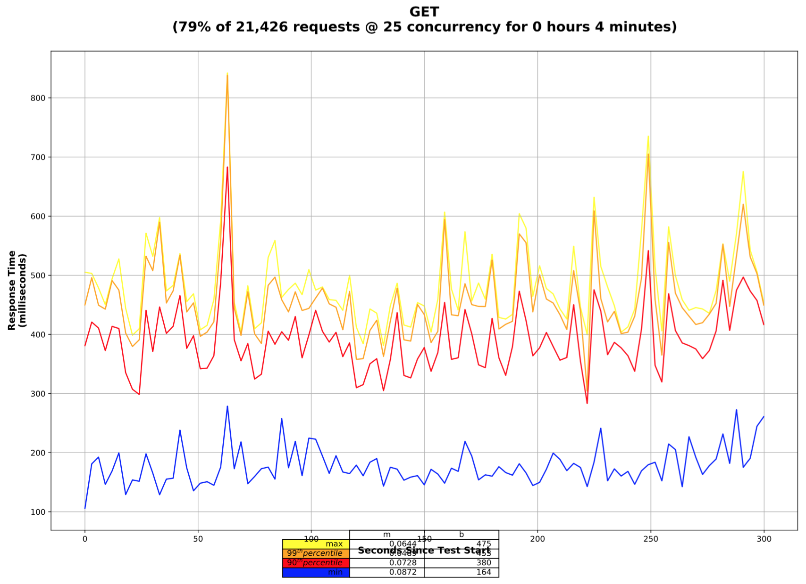

# analyze-restful-api-load-test-results


[](http://opensource.org/licenses/MIT)
[](https://www.python.org/downloads/release/python-370/)
[](https://requires.io/github/simonsdave/analyze-restful-api-load-test-results/requirements/?branch=master)
[](https://circleci.com/gh/simonsdave/analyze-restful-api-load-test-results)
[](https://codecov.io/gh/simonsdave/analyze-restful-api-load-test-results)
[](https://hub.docker.com/r/simonsdave/analyze-restful-api-load-test-results/)

As part of a microservice's CI process it's ideal to
load test a microservice's RESTful API to confirm
that changes to the microservice's codebase do not negatively
affect the microservice's performance characteristics.
There are a number of very good load testing tools - for
example [locust](http://locust.io),
[JMeter](http://jmeter.apache.org)
and [k6](https://k6.io).
These tools can easily drive load into a microservice.
The real challenge is the automated assessment of the load test results
and this is where ```analyze-restful-api-load-test-results``` helps.

## Process Overview

* drive load through the microservice using your favorite load
  testing tool and produce a [TSV](https://en.wikipedia.org/wiki/Tab-separated_values)
  file containing timing and success for each request issued during the
  load test
* in the context of a CI pipeline, ```analyze-restful-api-load-test-results```
  can be configured to numerically analyze the microservice's performance
  and produce a failing exit code if the performance falls outside of acceptable
  bounds
* run ```analyze-restful-api-load-test-results``` can optionally
  be configured to graphically assess the microservice's performance - saving
  the graphical assessment as a build artifact can prove useful when attempting
  to assess a numerical assessment failure

## Input File Format

The [TSV](https://en.wikipedia.org/wiki/Tab-separated_values) file is
input for ```analyze-restful-api-load-test-results```.
The file should be UTF8 encoded
and contain the fields below separated by a single tab.
[This](samples/001-input.tsv) is a sample input file.

* timestamp
* request type - typically this is going to be an HTTP verb but
  it can be any non-blank string
* success flag - 1 = success; 0 = failure
* client identifier - a non-blank string - only used to enable ```analyze-restful-api-load-test-results```
  to calculate concurrency levels - for [locust](http://locust.io) it's typically
  a locust ID and for [k6](https://k6.io) it's a VU id
* response time in milliseconds - a floating point number

## Running ```analyze-restful-api-load-test-results```

```analyze-restful-api-load-test-results``` is packaged in a docker image.
Why? [NumPy](http://www.numpy.org) and [Matplotlib](http://matplotlib.org)
are used by ```analyze-restful-api-load-test-results```
for numeric and graphical assessment of a microservice's performance.
Both these packages take a long time to install.
A CI pipeline should execute in the minimum time possible
and thus installing [NumPy](http://www.numpy.org) and [Matplotlib](http://matplotlib.org)
would unacceptably increase CI pipeline execution time.
Packaging ```analyze-restful-api-load-test-results``` in a docker image
means the CI pipeline only has to download the docker image which is
generally quite quick.

The following command runs ```analyze-restful-api-load-test-results```'s
numerical analysis on [this](samples/001-input.tsv) sample data.

```bash
~> docker run \
    -i \
    simonsdave/analyze-restful-api-load-test-results \
    analyze_restful_api_load_test_results.sh \
    < 001-input.tsv
=====================================================================================
21,426 @ 25 from 2017-07-19 01:25:02.410082+00:00 to 2017-07-19 01:30:02.245437+00:00
=====================================================================================

Request Type                 Ok Error         m        b      Min       50       95       99      Max
-----------------------------------------------------------------------------------------------------
GET                       17017     0    0.0551      293      106      290      432      509      842
PUT                        4409     0    0.0351      531      257      508      765     1131     1748

=====================================================================================
~>
```

The following command runs ```analyze-restful-api-load-test-results```'s
numerical and graphical analysis. The graphical analysis creates a PDF doc
called ```dave.pdf``` in the working directory.

```bash
~> docker run \
    -i \
    -v $PWD:/graphs \
    simonsdave/analyze-restful-api-load-test-results \
    analyze_restful_api_load_test_results.sh \
    --graphs=/graphs/dave.pdf \
    < 001-input.tsv
=====================================================================================
21,426 @ 25 from 2017-07-19 01:25:02.410082+00:00 to 2017-07-19 01:30:02.245437+00:00
=====================================================================================

Request Type                 Ok Error         m        b      Min       50       95       99      Max
-----------------------------------------------------------------------------------------------------
GET                       17017     0    0.0551      293      106      290      432      509      842
PUT                        4409     0    0.0351      531      257      508      765     1131     1748

=====================================================================================
~>
```

The ```dave.pdf``` doc will contain 1 page per request type. Each page will
contain a single graph that looks like the graph below and a sample of the
full PDF can be found [here](samples/001-input.pdf).


